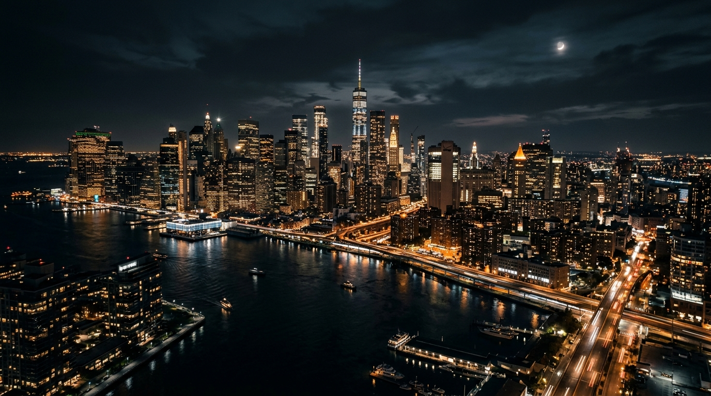

# GAH 24/7 - Luxury Corporate One-Page Proposal Redesign

Rediseño UX/UI de alta conversión y nivel ejecutivo para la landing page de **Global Accident Help (GAH 24/7)** en Miami, FL.

## 🌟 Características Principales

- **Íconos Vectoriales Corporativos (FontAwesome 6)**: Eliminación de emojis informales por simbología legal y de emergencia profesional.
- **Barra de Garantías Sutil**: Presentación fina de propuestas de valor (`24/7 Response`, `100% Free Evaluation`, `$0 Upfront Fees`, `Bilingual ENG/ESP`).
- **Diseño Responsive 100% Fluido**:
  - **Escritorio**: Rejilla amplia de 3 columnas con estética *Luxury Dark Gold Glassmorphism* y animaciones de desplazamiento.
  - **Móvil**: Formato estilizado sin saturación cognitiva, carrusel táctil de testimonios y **Barra Flotante Fija de Emergencia** (`Llamar 24/7` y `WhatsApp`).
- **Nuevas Secciones de Confianza**: Timeline de 3 pasos ("¿Cómo Funciona?"), acordeón interactivo de preguntas frecuentes (FAQ) y prueba social.

## 🛠️ Tecnologías Utilizadas

- **HTML5 Semántico**: Accesible y optimizado para SEO.
- **CSS Vanilla (Custom Properties & Media Queries)**: Sistema de diseño moderno sin librerías pesadas.
- **JavaScript ES6**: Lógica de menú móvil, observador de scroll (`IntersectionObserver`), modal interactivo y acordeón de FAQ.
- **FontAwesome 6**: Íconos vectoriales de alta definición.

---
*Diseñado como propuesta comercial de alto impacto.*
